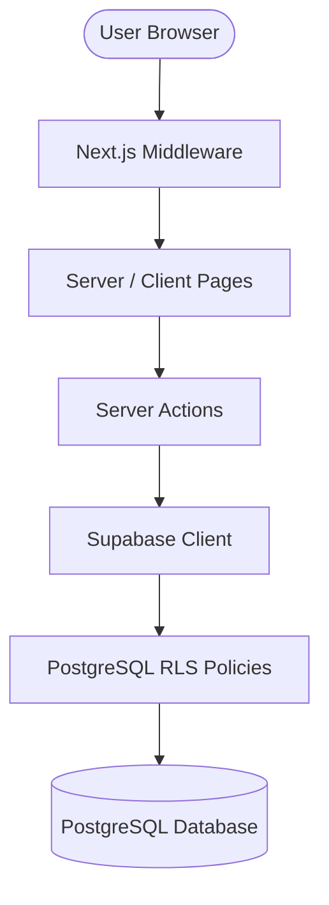

# IMP3RIAL EDU Technical Documentation

This document provides a comprehensive technical overview of the IMP3RIAL EDU system architecture, multi-tenancy model, security enforcement, and core features.

---

## 1. System Architecture

IMP3RIAL EDU is built as a single-instance, multi-tenant B2B SaaS platform using **Next.js 16 (App Router)** and **Supabase (PostgreSQL)**.



### 1.1 Next.js App Router Structure
- `/src/app/page.js`: Landings page describing features, pricing, and portals.
- `/src/app/login/page.js` & `/src/app/register/page.js`: Credentials entry and school onboarding.
- `/src/app/dashboard/`: Protected environment. Sub-folders segment routing based on user roles:
  - `/dashboard/super-admin/`: SaaS tier allocations, school listings, and platform metrics.
  - `/dashboard/admin/`: Academic administration, school rosters, billing status.
  - `/dashboard/teacher/`: Classes allocation, grade-books, attendance sheets, exam constructor.
  - `/dashboard/student/`: CBT examinations environment, assignment repository, fee reports.
  - `/dashboard/parent/`: Performance logs, attendance tracking, and integrity flags reports.

---

## 2. Security & Multi-Tenancy Model

IMP3RIAL EDU enforces strict multi-tenancy at both the database layer (via RLS) and the server actions layer (via verification helper functions).

### 2.1 PostgreSQL Row-Level Security (RLS)
Every database table (except the system `schools` list) contains a `school_id` column. User profiles are also tied to a `school_id`. RLS policies verify that:
- Read operations are limited to rows sharing the user's `school_id`.
- Insert, Update, and Delete operations are blocked unless the target record's `school_id` matches the user's mapped `school_id`.

Example RLS Policy for `classes`:
```sql
CREATE POLICY "Enforce school isolation for classes" 
ON public.classes 
FOR ALL 
USING (school_id = (SELECT school_id FROM public.profiles WHERE id = auth.uid()));
```

### 2.2 Server-Side Tenant Verification (`verifyTenantOwnership`)
To defend against ID-harvesting and direct object reference (IDOR) attacks, the Next.js Server Actions utilize a centralized validation helper `verifyTenantOwnership(references, schoolId, client)` inside `src/app/actions.js`.

This helper takes a list of resources (table name + record ID) and verifies that each record belongs to the operator's school before executing writes:

```javascript
async function verifyTenantOwnership(references, schoolId, client) {
  for (const ref of references) {
    if (!ref.id) {
      throw new Error(`Missing required identifier for ${ref.table}.`);
    }
    const { data, error } = await client
      .from(ref.table)
      .select('school_id')
      .eq('id', ref.id)
      .single();

    if (error || !data) {
      throw new Error(`Resource ${ref.table} (${ref.id}) not found.`);
    }
    if (data.school_id !== schoolId) {
      throw new Error(`Unauthorized cross-tenant reference detected in ${ref.table}.`);
    }
  }
}
```

---

## 3. Core Functional Workflows

### 3.1 Authentication & Brute-Force Protection
User login is handled in `loginUser(prevState, formData)` Server Action:
1. Checks if the account email is locked due to too many failed login attempts (queries `failed_login_attempts` table).
2. If the user is currently locked, it blocks sign-in and displays a time remaining counter.
3. If credentials fail, it increments the failure count. On the 5th failed attempt, the email is locked out for 15 minutes.
4. On success, it resets the failed login counter.

### 3.2 Timetabling & Subject Allocation
- School admins allocate courses to teachers by inserting into the `course_allocations` table.
- Timetable slots are mapped per class and subject. RLS and tenant ownership enforce that conflicts (e.g. overlapping class rooms or teacher hours) are only managed for the same institution.

### 3.3 Computer-Based Testing (CBT) & Proctoring
The CBT module has built-in client-server integrity protection:
- **Client Proctoring:** The browser listens to `fullscreenchange`, `visibilitychange` (tab switching), and uses a audio analyzer (noise level tracking) to spot talking or background noise.
- **Lockout Enforcer:** Exiting fullscreen mode or switching tabs three times flags the exam attempt as `proctor_violated`, locking the student out of the test and immediately auto-submitting the current score.
- **Score Recalculation:** Scores are recalculated on the server-side upon submission based on database questions answers keys, rendering student-side request manipulations ineffective.

### 3.4 Student Promotions & Class Upgrades
- Admins can bulk-promote student profiles to next grade levels.
- The platform enforces subscription limitations: if a school has a student cap of 100, the system prevents user additions if the limit is breached, blocking actions with a `"Limit exceeded"` exception.

---

## 4. Next.js Middleware Configuration

The system uses standard Next.js middleware at `src/middleware.js` to inspect authorization headers and session cookies:
- **Unauthenticated Redirects:** Redirects anonymous users to `/login` if they attempt to load `/dashboard/*`.
- **Authenticated Redirects:** Redirects logged-in users back to `/dashboard` if they attempt to access public pages like `/login` or `/register`.
- **Match Paths:** The middleware is active for all routes except static bundles, CSS files, standard icons, and image directories.
